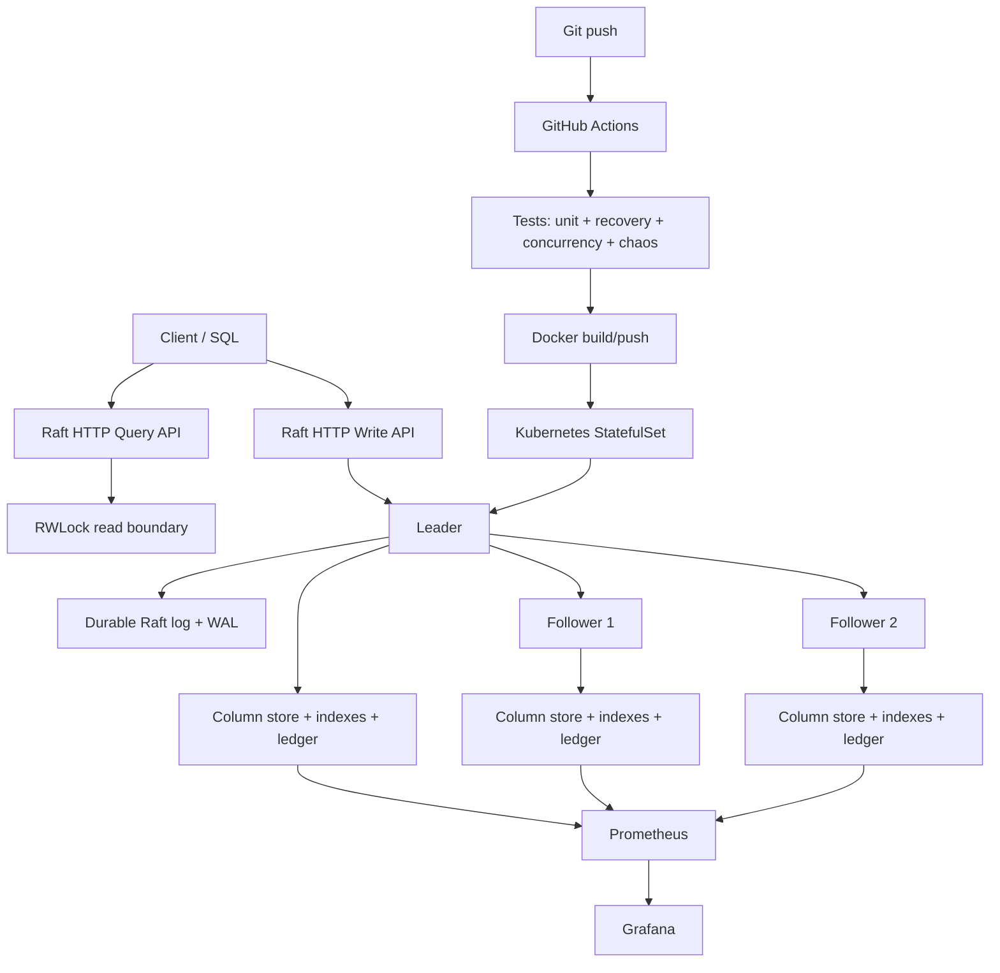

# LedgerDB v1.0 Architecture

## Request path

1. SQL is parsed into a deliberately bounded query AST.
2. The planner selects equality/range indexes, hash aggregation, or sort-merge join.
3. Reads execute under the reader side of the global RW lock.
4. Writes enter through the Raft leader.
5. The leader appends the command to its durable log and replicates it to followers.
6. Each node materializes committed commands into durable column/index/ledger storage.
7. Prometheus scrapes node health, leadership, lag, query latency, and transaction counters.

## Deployment topology

Kubernetes uses a three-replica StatefulSet and a headless Service. StatefulSet identities provide stable Raft peer addresses. Query readiness excludes followers that have lost recent leader contact or have not caught up.
